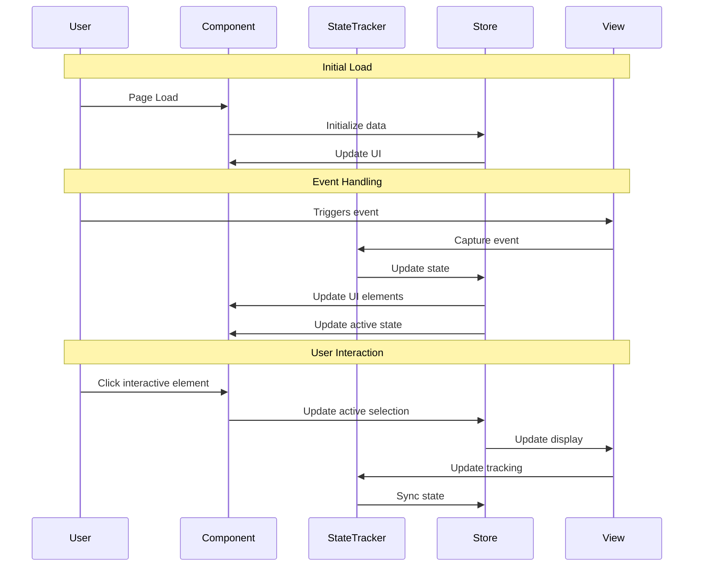

# Flappy Bird - Implementation Planning 🐱 喵～

## User Story

As a player, I want to control a bird to fly through obstacles by tapping the screen, so that I can challenge myself and compete for high scores 🐱 喵～

## Pre-conditions

- 用户已进入游戏主界面 🐱 喵～
- 游戏资源加载完毕，准备就绪 🐱 喵～
- 若有排行榜功能，需已初始化相关数据 🐱 喵～

## Design

### Visual Layout
- 主界面包含：Logo、开始按钮、排行榜入口（可选）🐱 喵～
- 游戏区：小鸟、障碍物（如管道）、分数显示、背景 🐱 喵～
- 结束页：分数统计、重新开始、排行榜入口 🐱 喵～

### Color and Typography
- **背景色**：bg-white dark:bg-gray-900
- **障碍物**：bg-green-500 dark:bg-green-700
- **按钮**：bg-blue-500 text-white hover:bg-blue-600 active:bg-blue-700
- **字体**：font-inter text-base text-gray-900 dark:text-white
- **分数**：text-yellow-500 font-bold

### Interaction Patterns
- **按钮交互**：悬停变色，点击缩放，加载时禁用，支持键盘导航 🐱 喵～
- **小鸟控制**：每次点击屏幕/空格键，小鸟向上扑腾一次 🐱 喵～
- **障碍物移动**：障碍物从右向左匀速移动，定时生成 🐱 喵～
- **碰撞检测**：小鸟碰撞障碍物或飞出边界则游戏结束 🐱 喵～

### Measurements and Spacing
- **容器**：max-w-7xl mx-auto px-4 sm:px-6 lg:px-8
- **组件间距**：space-y-6，障碍物间距固定或随机，分数区与顶部有足够留白 🐱 喵～

### Responsive Behavior
- 桌面端：横向布局，侧边栏可显示排行榜 🐱 喵～
- 平板端：主内容居中，排行榜可折叠 🐱 喵～
- 移动端：全屏堆叠，按钮大尺寸，排行榜入口为悬浮按钮 🐱 喵～

## Technical Requirements

### Component Structure
```
src/app/flappy-bird/
├── page.tsx
└── _components/
    ├── Bird.tsx           # 小鸟渲染与动画
    ├── Obstacle.tsx       # 障碍物渲染与移动
    ├── ScoreBoard.tsx     # 分数与排行榜显示
    └── useGameLogic.ts    # 游戏主逻辑与状态管理
```

### Required Components
- Bird ⬜
- Obstacle ⬜
- ScoreBoard ⬜
- useGameLogic ⬜

### State Management Requirements
```typescript
interface GameState {
  isRunning: boolean;
  isGameOver: boolean;
  score: number;
  birdPosition: number;
  birdVelocity: number;
  obstacles: Obstacle[];
  leaderboard: PlayerScore[];
}

const actions = {
  startGame: () => void;
  endGame: () => void;
  updateBird: (position: number, velocity: number) => void;
  addObstacle: (obstacle: Obstacle) => void;
  removeObstacle: (id: string) => void;
  updateScore: (score: number) => void;
  updateLeaderboard: (scores: PlayerScore[]) => void;
}
```

## Acceptance Criteria

### Layout & Content
1. Header Section
   - Logo、排行榜入口、开始按钮，移动端收纳为菜单 🐱 喵～
2. Main Content Area
   - 游戏区居中，障碍物与小鸟动态渲染 🐱 喵～
3. Component Layout
   - 分数悬浮于顶部，排行榜弹窗/侧栏 🐱 喵～

### Functionality
1. 基本玩法
   - [ ] 点击屏幕/空格键小鸟上升
   - [ ] 小鸟持续下落受重力影响
   - [ ] 障碍物定时生成并移动
   - [ ] 成功穿越障碍物得分
   - [ ] 碰撞检测导致游戏结束
2. 排行榜与分享
   - [ ] 游戏结束后可查看排行榜
   - [ ] 支持分数分享
3. 技术细节
   - [ ] 物理引擎模拟重力与速度
   - [ ] 障碍物高度随机
   - [ ] 无素材时用简单图形代替
   - [ ] 可选：音效与动画

### Navigation Rules
- 游戏主循环：开始→游戏→结束→排行榜→返回首页 🐱 喵～
- 排行榜入口随时可见 🐱 喵～

### Error Handling
- 游戏资源加载失败时提示重试 🐱 喵～
- 排行榜数据异常时降级为本地分数 🐱 喵～

## Modified Files
```
src/app/flappy-bird/
├── page.tsx ⬜
└── _components/
    ├── Bird.tsx ⬜
    ├── Obstacle.tsx ⬜
    ├── ScoreBoard.tsx ⬜
    └── useGameLogic.ts ⬜
├── store/
│   └── gameStore.ts ⬜
└── types/
    └── gameTypes.ts ⬜
```

## Status
🟨 IN PROGRESS

1. Setup & Configuration
   - [ ] 初始化项目结构
   - [ ] 配置状态管理
   - [ ] 配置基础样式
2. Layout Implementation
   - [ ] 主界面布局
   - [ ] 游戏区与分数区
   - [ ] 结束页与排行榜
3. Feature Implementation
   - [ ] 小鸟控制与动画
   - [ ] 障碍物生成与移动
   - [ ] 分数与排行榜逻辑
4. Testing
   - [ ] 单元测试
   - [ ] 交互测试
   - [ ] 响应式测试
   - [ ] 边界与异常测试

## Dependencies
- 状态管理库（如zustand/recoil）
- UI 框架（如TailwindCSS）
- 可选：音效库

## Related Stories
- flappy-bird-story-1-basic-mechanics（基本玩法）
- flappy-bird-story-2-obstacles-and-scoring（障碍与得分）
- flappy-bird-story-3-leaderboard-and-social（排行榜与分享）
- flappy-bird-story-4-technical-details（技术细节）
- flappy-bird-story-5-other-notes（其他说明）

## Notes
### Technical Considerations
1. 物理引擎需简洁高效，避免性能瓶颈 🐱 喵～
2. 障碍物生成算法需保证公平性与可玩性 🐱 喵～
3. 响应式布局适配多端 🐱 喵～
4. 排行榜数据需安全存储与同步 🐱 喵～
5. 代码需高可读性与可维护性 🐱 喵～

### Business Requirements
- 游戏体验流畅，操作简单 🐱 喵～
- 支持排行榜与分数分享，提升用户粘性 🐱 喵～
- 支持无素材占位，快速上线 MVP 🐱 喵～
- 可扩展皮肤、音效等增值功能 🐱 喵～

### API Integration
#### Type Definitions
```typescript
interface Obstacle {
  id: string;
  height: number;
  position: number;
}

interface PlayerScore {
  id: string;
  name: string;
  score: number;
}

interface GameState {
  isRunning: boolean;
  isGameOver: boolean;
  score: number;
  birdPosition: number;
  birdVelocity: number;
  obstacles: Obstacle[];
  leaderboard: PlayerScore[];
}
```

#### Mock Implementation
```typescript
// filepath: mocks/stub.ts
const mocks = [
  {
    endPoint: '/api/leaderboard',
    json: 'leaderboard.json',
  },
];
```
```json
// filepath: mocks/responses/leaderboard.json
{
  "status": "SUCCESS",
  "data": {
    "leaderboard": [
      { "id": "1", "name": "Alice", "score": 42 },
      { "id": "2", "name": "Bob", "score": 35 }
    ]
  }
}
```

### State Management Flow


### Custom Hook Implementation
```typescript
const useGameLogic = () => {
  const store = useGameStore();

  useEffect(() => {
    const handleTick = () => {
      // 游戏主循环逻辑
    };
    // 绑定定时器等
    return () => {/* 清理 */};
  }, []);

  const jump = useCallback(() => {
    // 小鸟上升逻辑
  }, []);

  return {
    jump,
    ...store,
  };
};
```

## Testing Requirements
- 单元测试覆盖核心逻辑，目标80%+
- 响应式与交互测试
- 边界与异常场景测试
- 可访问性测试

🐱 喵～
